# 프로젝트명
<a href="https://github.com/osamhack2021/WEB_CLOUD_ArMeal_CSK">
  
</a>

## 프로젝트 소개
> '설문조사 주기가 왜 이렇게 길까?' <br/>
> '귀찮게... 왜 개인정비 시간에 설문을 시켜..' <br/>
> "야 대충 한명이 써서 내자, 고기로 골라 고기"<br/>
> '이번엔 모바일로 설문받는다고? 폰쓸시간 아깝게.. 대충 쓰고 끝내야지'<br/>

최근 많은 이슈가 발생한 군 급식문제..<br/> 
군에서는 이를 해결하기 위해 급식비 확대, 비 선호 메뉴 제거, 신메뉴 추가와 같은 여러가지 노력을 하고있습니다. <br/>

식단은 변화하고 있지만, <b>그 속도가 너무 더딥니다.</b><br/>
종이, 온라인 폼과 같은 <b>설문 방식</b>에도 아쉬움이 많고,<br/> 
<b>설문자의 태도</b>마저 문제가 많습니다. 

모든 메뉴를 평가하지 않으며, 평가할 수도 없는 평가방식..<br/>
설문을 그저 개인의 시간을 뺏는 귀찮은 일이라고 생각하는 용사들의 행동..<br/>

### 이 두가지 문제와, 이로 인해 파생되는 모든 문제들을 ArMeal로 전부 해결하겠습니다.
1. 최대 <b>두 번</b>의 터치로 설문은 빠르고 간단하게 진행됩니다. 
2. 병영식당 출구 쪽에 위치시켜 시간 손실을 최소화시킵니다.
3. 모든 식단에 대해서 평가합니다.
4. 설문 결과로 데이터베이스를 이루어 통계를 제공하고, 이를 통해 수많은 개선점을 만들어냅니다.

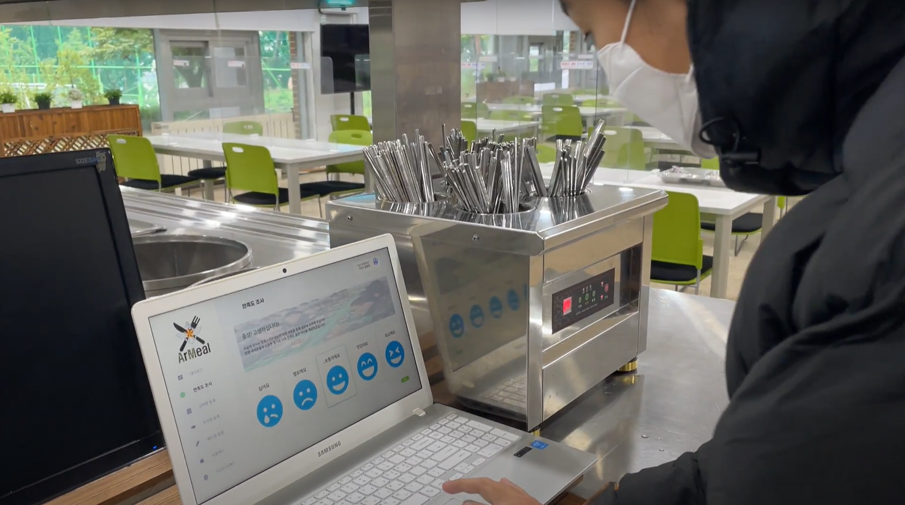

## 기능 설명
<table>
  <tbody>
		<tr>
			<td colspan=2>
				<br>
				<b>대시보드</b><br>
				<br>
			</td>
		</tr>
		<tr>
      <td rowspan="2">
        <div align="center">
          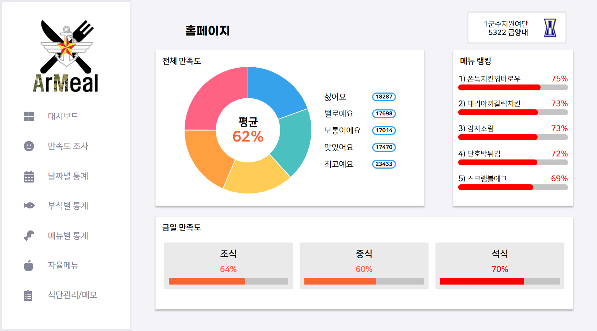
        </div>
      </td>
      <td width="28%">전체적인 통계를 확인할 수 있습니다.</td>
    </tr>
    <tr>
      <td>우리 부대에서 인기가 많은 메뉴는 무엇인지 확인해보세요!</td>
    </tr>
  </tbody>
</table>
<br><br>
<table>
  <tbody>
		<tr>
			<td colspan=2>
				<br>
				<b>만족도 조사</b><br>
				<br>
			</td>
		</tr>
		<tr>
      <td rowspan="2">
        <div align="center">
          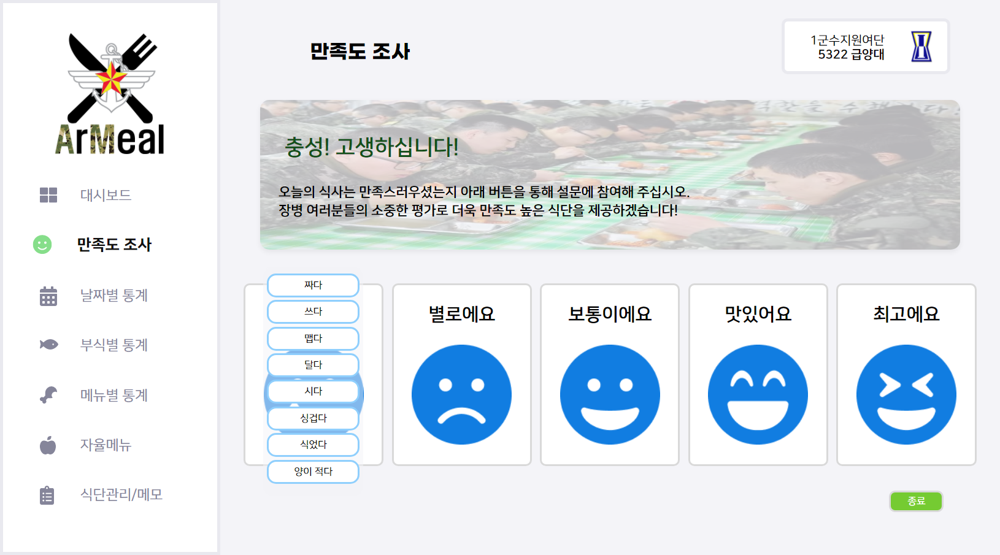
        </div>
      </td>
      <td width="30%"><b>실시간</b>으로 장병들의 만족도를 수집합니다.</td>
    </tr>
    <tr>
      <td>식사에 불만족한 경우, 불만족한 사유를 수집해서 통계에 활용합니다.</td>
    </tr>
    <tr>
      <td rowspan="2">
        <div align="center">
          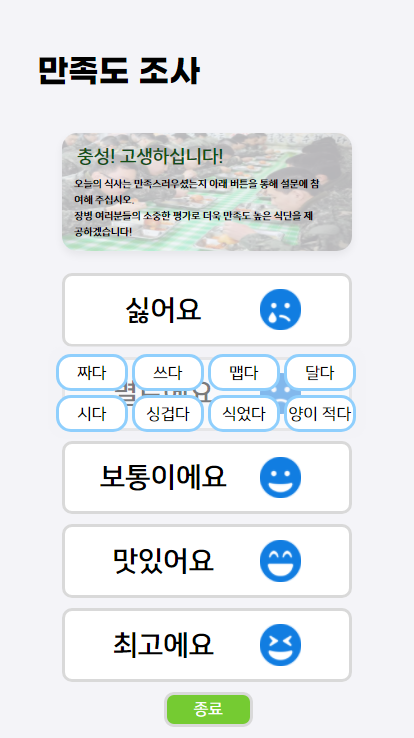
        </div>
      </td>
      <td>야외 훈련 등 네트워크 연결이 어려운 상황을 대비해 <b>오프라인 상태로도 정보를 수집</b>합니다.</td>
    </tr>
    <tr>
      <td><b>모바일, 태블릿용 화면</b>도 구현되어있어 부대 여건에 맞게 활용 가능!</td>
    </tr>
  </tbody>
</table>
<br><br>
<table>
  <tbody>
		<tr>
			<td colspan=2>
				<br>
				<b>날짜별 통계</b><br>
				<br>
			</td>
		</tr>
		<tr>
      <td rowspan="2">
        <div align="center">
          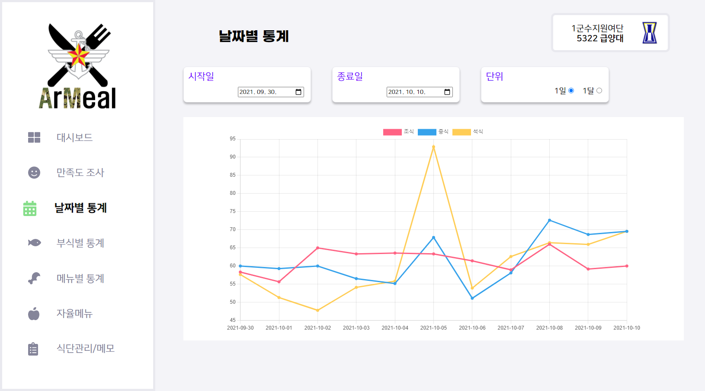
        </div>
      </td>
      <td width="28%">원하는 구간의 날짜별 통계를 확인할 수 있습니다.</td>
    </tr>
    <tr>
      <td>우리 병영식당이 어떤 시간대에 주로 신경써야하는지 확인합시다!</td>
    </tr>
  </tbody>
</table>
<br><br>

<table>
  <tbody>
		<tr>
			<td colspan=2>
				<br>
				<b>부식별ㆍ메뉴별 통계</b><br>
				<br>
			</td>
		</tr>
		<tr>
      <td rowspan="2">
        <div align="center">
          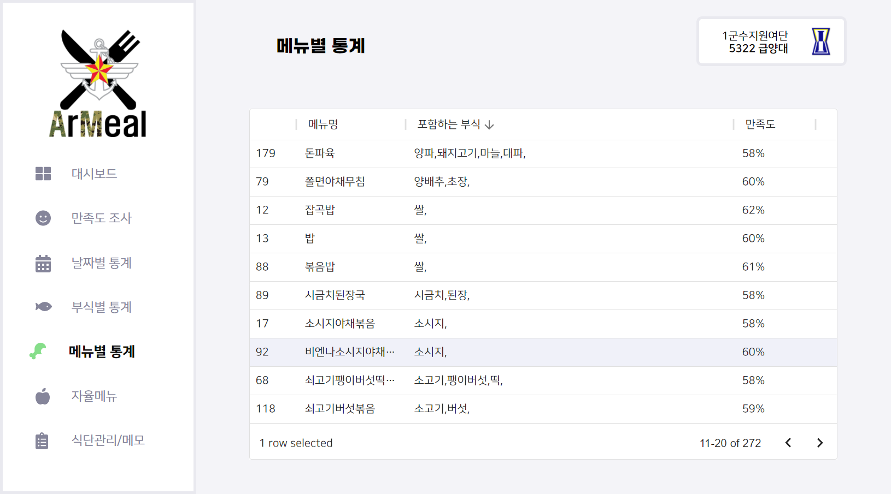
        </div>
      </td>
      <td width="28%">부식별, 메뉴별 통계를 한눈에 볼 수 있습니다.</td>
    </tr>
    <tr>
      <td>만족도, 이름별로 정렬해 원하는 대상을 쉽게 찾을 수 있습니다.</td>
    </tr>
    <tr>
      <td rowspan="2">
        <div align="center">
          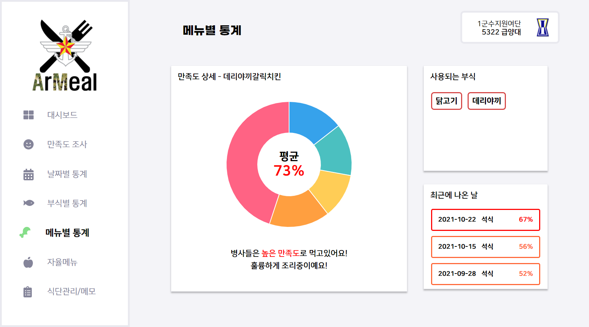
        </div>
      </td>
      <td>각 부식과 메뉴의 세부 정보를 확인할 수 있습니다.</td>
    </tr>
    <tr>
      <td>메뉴에 어떤 부식이 들어가는지, 메뉴에 대한 평가가 어떤지 등 <b>필요한 정보들</b>을 모았습니다.</td>
    </tr>
  </tbody>
</table>
<br><br>
</table>

<br><br>
<table>
  <tbody>
		<tr>
			<td colspan=2>
				<br>
				<b>자율메뉴</b><br>
				<br>
			</td>
		</tr>
		<tr>
      <td rowspan="2">
        <div align="center">
          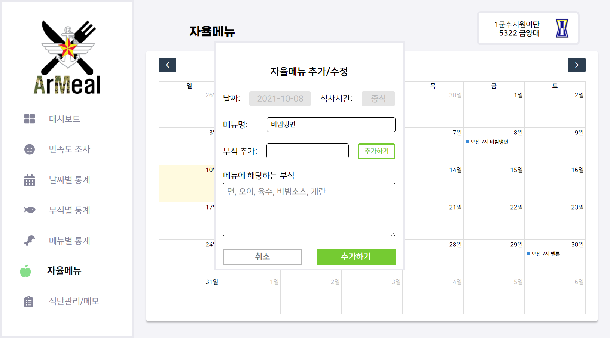
        </div>
      </td>
      <td width="28%">부대에서 직접 시행하는 자율메뉴를 추가할 수 있습니다.</td>
    </tr>
    <tr>
      <td>부대가 선택권을 가지는 만큼 만족도 확인은 <b>중요하죠!</b></td>
    </tr>
  </tbody>
</table>
<br><br>

</table>
<br><br>
<table>
  <tbody>
		<tr>
			<td colspan=2>
				<br>
				<b>식단관리</b><br>
				<br>
			</td>
		</tr>
		<tr>
      <td rowspan="2">
        <div align="center">
          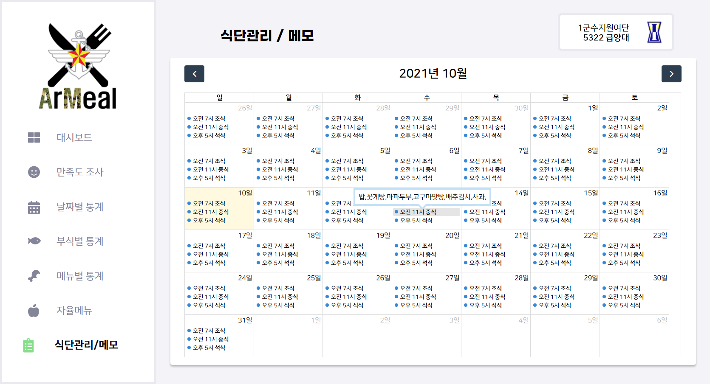
        </div>
      </td>
      <td width="28%">모든 식단을 모아서 확인하고, 메모를 추가할 수 있습니다.</td>
    </tr>
    <tr>
      <td><b>공공데이터 포털</b>에 게시되어있는 부대의 식단정보를 알아서 입력해줍니다!</td>
    </tr>
  </tbody>
</table>
<br><br>

</table>
<br><br>
<table>
  <tbody>
		<tr>
			<td colspan=2>
				<br>
				<b>회원가입ㆍ로그인</b><br>
				<br>
			</td>
		</tr>
		<tr>
      <td rowspan="2">
        <div align="center">
          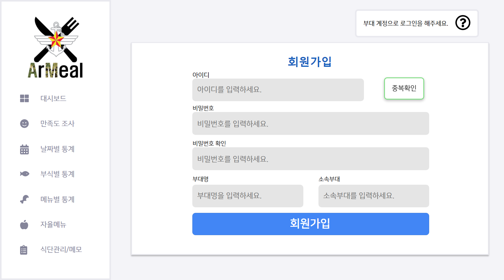
        </div>
      </td>
      <td width="28%">같은 급양대 소속의 부대는 기본적인 식단정보를 공유합니다!</td>
    </tr>
    <tr>
      <td>간편한 로그인으로 설문조사ㆍ확인도 간편하게 진행할 수 있습니다.</td>
    </tr>
  </tbody>
</table>

## Service Flow
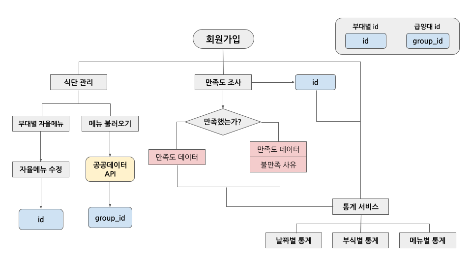


## 기대 효과
1. 급양대별, 부대별로 나눈 데이터베이스를 통해 체계적이며 간단한 식단 관리
2. 자율메뉴를 신중하게 선택하게 되며, 이에 따른 품질 또한 발전 기대
3. 부대별로 상이한 부식 청구량을 더욱 알맞게 변화시켜줄 좋은 이정표
4. 불만족 사유 통계를 활용해 같은 메뉴가 나올 시 더 나은 메뉴가 될 가능성
5. 식단마다 메모를 작성하고, 쉽게 확인하며 발전 기대
6. 추후 더 광범위한 부대를 상대로 랭킹, 커뮤니티 기능 등 통계치를 활용할 가능성

## 컴퓨터 구성 / 필수 조건 안내 (Prerequisites)
* 권장: ES6를 지원하는 Chromium 기반의 웹 브라우저(Chrome, Naver Whale, Microsoft Edge 등)
* Node.js 14.18.1 이상

## 기술 스택 (Technique Used)
<h3 align="center"></h3>

### Server(back-end)
 - Spring Boot 2.0.1
 - MySQL 5.7.35
 - Swagger 2.9.2
 - Maven 3.6.3
 - Java (OpenJDK 1.8.0_292)
 - Nginx

### Front-end
 - react.js
 - redux
   - react-redux
   - redux-logger
   - redux-thunk
 - react-router-dom
 - styled-component
 - axios
 - UI library
   - chart.js
   - tooltip.js
   - material-ui/data-grid
   - fullcalendar
 
### Back-end
<table><tbody>
 <tr>
  <td width="60">
   <div align="center"><a href="https://spring.io/" target="_blank">  </a><br>SpringBoot</div>
  </td>
  <td width="60">
   <div align="center"><a href="https://spring.io/projects/spring-security" target="_blank">  </a><br>SpringSecurity</div>
  </td>
  <td width="60">
   <div align="center"><a href="https://swagger.io/" target="_blank">  </a><br>Swagger</div>
  </td>
  <td width="60">
   <div align="center"><a href="https://mybatis.org/mybatis-3/ko/index.html" target="_blank">  </a><br>Mybatis</div>
  </td>
  <td width="60">
   <div align="center"><a href="https://github.com/google/gson" target="_blank">  </a><br>GSON</div>
  </td>
  <td width="60">
   <div align="center"><a href="https://www.nginx.com/" target="_blank">  </a><br>Nginx</div>
  </td>
  <td width="60">
   <div align="center"><a href="http://tomcat.apache.org/" target="_blank">  </a><br>Tomcat</div>
  </td>
  </td>
  <td width="60">
   <div align="center"><a href="https://maven.apache.org/" target="_blank">  </a><br>Maven</div>
  </td>
  <td>
  <div align="center"><a href="https://www.java.com/ko/" target="_blank"> 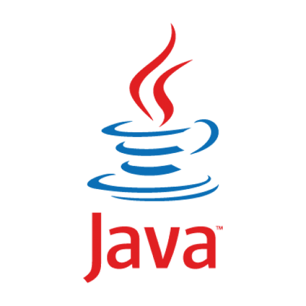 </a><br>Java</div>
  </td>
 </tr>
 </tbody></table>
  
### Front-end
<table><tbody>
 <tr>
  <td>
   <div align="center"><a href="https://ko.reactjs.org/" target="_blank">  </a><br>React.js</div>
  </td>
  <td>
   <div align="center"><a href="https://github.com/axios/axios" target="_blank">  </a><br>Axios</div>
  </td>
  <td>
   <div align="center"><a href="https://styled-components.com/" target="_blank">  </a><br>Styled Components</div>
  </td>
  <td width="60">
   <div align="center"><a href="https://developer.mozilla.org/ko/docs/Web/JavaScript" target="_blank">  </a><br>Javascript</div>
  </td>
  <td>
   <div align="center"><a href="https://dev.w3.org/html5/html-author/" target="_blank"> 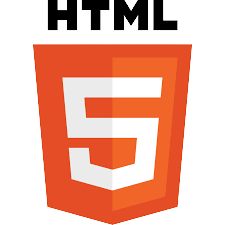 </a><br>Html5</div>
  </td>
  <td>
   <div align="center"><a href="https://developer.mozilla.org/ko/docs/Web/CSS/Reference" target="_blank">  </a><br>CSS</div>
  </td>
  <td>
   <div align="center"><a href="https://babeljs.io/" target="_blank">  </a><br>Babel</div>
  </td>
  <td>
   <div align="center"><a href="https://webpack.js.org/" target="_blank">  </a><br>Webpack</div>
  </td>
  <td>
   <div align="center"><a href="https://reactrouter.com/" target="_blank">  </a><br>React Router</div>
  </td>
 </tr>
 </tbody></table>
 
 ### Database
 <table><tbody>
 <tr>
  <td>
   <div align="center"><a href="https://www.mysql.com/" target="_blank">  </a><br>MySQL</div>
  </td></tr>
 </tbody></table>


## 설치 안내 (Installation Process)
```bash
$ git clone https://github.com/osamhack2021/WEB_CLOUD_ArMeal_CSK.git
$ cd WEB(FE)/
$ yarn or npm install
$ yarn start or npm run start
```

## 프로젝트 사용법 (Getting Started)

1. 부대명, 소속부대를 입력하고 회원가입합니다.
2. 해당 계정으로 로그인합니다.
3. 식단관리 탭에서 소속부대의 식단이 잘 받아와졌는지 확인합니다.
4. 만족도조사 탭에서 만족도조사를 실시합니다.
5. 쌓인 설문 결과를 다양한 통계 탭에서 확인합니다.
 
## 팀 정보 (Team Information)
- 최원빈 (chldnjsqls1264@gmail.com), Github: ChoiWonBeen
- 최준호 (junho5336@gmail.com), Github: Choi-JJunho
- 김대민 (daemingim5@gmail.com), Github: KDM777
- 신윤기 (ryunkishin@gmail.com), Github: ryunki
- 권성현 (rushhour.k@gmail.com), Github: SeonghyeonGwon

## 저작권 및 사용권 정보 (Copyleft / End User License)
 * https://github.com/osamhack2021/WEB_CLOUD_ArMeal_CSK/blob/main/LICENSE.md
   - MIT
   - Apache 2.0
   - The Universal FOSS Exception 1.0
   - SIL OPEN FONT LICENSE Version 1.1
